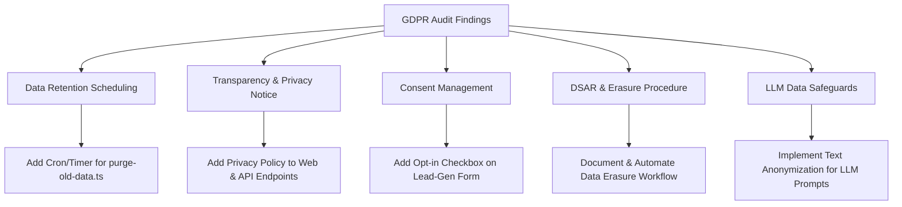

# GDPR Compliance & Remediation Plan (`seo-tools`)

**Project:** `seo-tools` (On-Page SEO Analyzer, Crawler, and MCP Server)  
**Location:** `/home/siva01/projects/lkv/seo-tools`  
**Date:** July 18, 2026  
**Status:** In Progress / Active Remediation  

---

## Executive Overview

Following a technical GDPR audit, `seo-tools` was assessed as **Partially Compliant**. While technical security controls (SSRF protection, sliding-window rate limiting, in-memory email TTL, and security headers) are robust, key privacy governance, transparency, and data retention scheduling gaps must be remediated.

This document serves as the operational roadmap to achieve full GDPR compliance across all technical and administrative layers of `seo-tools`.

---

## Key Compliance Gaps & Action Items



---

## 1. Automated Data Retention & Disposal (Art. 5(1)(e))

### Current Gap
`scripts/purge-old-data.ts` enforces a 90-day retention cutoff across `storage/{datasets,key_value_stores,request_queues,logs,reports}/<domain>/<date>/`, but it must be invoked manually today.

### Remediation Tasks
- [ ] **Task 1.1:** Add a daily cron job in host server crontab or container entrypoint:
  ```bash
  0 3 * * * cd /home/siva01/projects/lkv/seo-tools && docker compose run --rm app npm run purge-old-data -- --days 90
  ```
- [ ] **Task 1.2:** Log purging executions to `storage/logs/retention-purge.log` for auditability.
- [ ] **Task 1.3:** Add unit/integration tests verifying `scripts/purge-old-data.ts` correctly deletes date folders older than 90 days without altering recent records.

---

## 2. Transparency & Information Obligations (Art. 13 & Art. 14)

### Current Gap
The public lead-generation flow on `/api/crawl` accepts email addresses to deliver audit reports, but does not present a Privacy Policy, specify data controller contact details, or clarify storage duration.

### Remediation Tasks
- [ ] **Task 2.1:** Publish a dedicated `PRIVACY.md` / `privacy-policy.html` served by the static frontend (`seo.ludekkvapil.cz`).
- [ ] **Task 2.2:** Update `src/mcp-server.ts` to include standard privacy headers or links in JSON API responses:
  - Data Controller: `info@ludekkvapil.cz`
  - Purpose: One-time delivery of requested SEO report
  - Retention: In-memory for 24 hours (`JOB_TTL_MS`)
- [ ] **Task 2.3:** Add link to the Privacy Policy directly below the email input field on the web UI.

---

## 3. Consent Management (Art. 6(1)(a) & Art. 7)

### Current Gap
Submitting an email on the public `/api/crawl` endpoint triggers immediate processing without explicit opt-in confirmation or recording of consent.

### Remediation Tasks
- [ ] **Task 3.1:** Add an explicit, un-ticked consent checkbox to the lead-gen form:  
  `[ ] I consent to processing my email to receive the SEO audit report in accordance with the Privacy Policy.`
- [ ] **Task 3.2:** Update `/api/crawl` request validation to accept a `consent: boolean` field, rejecting requests where consent is `false` or missing when an email is supplied.

---

## 4. Data Subject Rights (DSAR & Erasure - Art. 15 & Art. 17)

### Current Gap
Crawled web pages may contain personal data of third parties (e.g. author names, contact details, profile descriptions). There is no documented procedure for handling removal requests from data subjects or site owners.

### Remediation Tasks
- [ ] **Task 4.1:** Document a clear administrative procedure in `docs/security.md` for processing erasure requests.
- [ ] **Task 4.2:** Support targeted domain/page deletion via `scripts/purge-old-data.ts`:
  ```bash
  npx tsx scripts/purge-old-data.ts --domain targetdomain.com --days 0
  ```
- [ ] **Task 4.3:** Set up a dedicated contact email (`privacy@ludekkvapil.cz` or `info@ludekkvapil.cz`) for receiving privacy inquiries.

---

## 5. Third-Party LLM & International Data Transfer Safeguards (Art. 28 & Art. 44)

### Current Gap
`src/services/llmClient.ts` sends page content excerpts to OpenAI to generate suggested title/description fixes. If scraped page excerpts contain personal data, this constitutes a third-party transfer outside the EEA.

### Remediation Tasks
- [ ] **Task 5.1:** Strip email addresses, phone numbers, and potential personal identifiers from `contentExcerpt` before passing payloads to `generateTitleDescriptionFix()`.
- [ ] **Task 5.2:** Confirm OpenAI Data Processing Addendum (DPA) with Standard Contractual Clauses (SCCs) is active for the API key used.
- [ ] **Task 5.3:** Support local LLM processing via Ollama (`LLM_PROVIDER=ollama`) as a privacy-preserving default for sensitive environments.

---

## Verification & Monitoring Checklist

| Component | Verification Method | Frequency | Target |
| :--- | :--- | :--- | :--- |
| **Purge Scheduler** | Cron execution log check | Weekly | 0 records >90 days old |
| **Privacy Notices** | Static UI audit | Monthly | Active links to Policy |
| **Consent Logging** | Request validation tests | CI Pipeline | Reject missing consent |
| **Data Anonymization** | Unit test `llmClient.ts` inputs | CI Pipeline | 0 PII in LLM payloads |

---

## Timeline & Ownership

- **Phase 1 (Immediate - Week 1):** Schedule automated data purge & publish Privacy Policy.
- **Phase 2 (Short-Term - Weeks 2-3):** Add consent checkbox to UI and backend API validation.
- **Phase 3 (Medium-Term - Month 2):** Implement PII scrubbing for LLM prompts and finalize DPA documentation.
